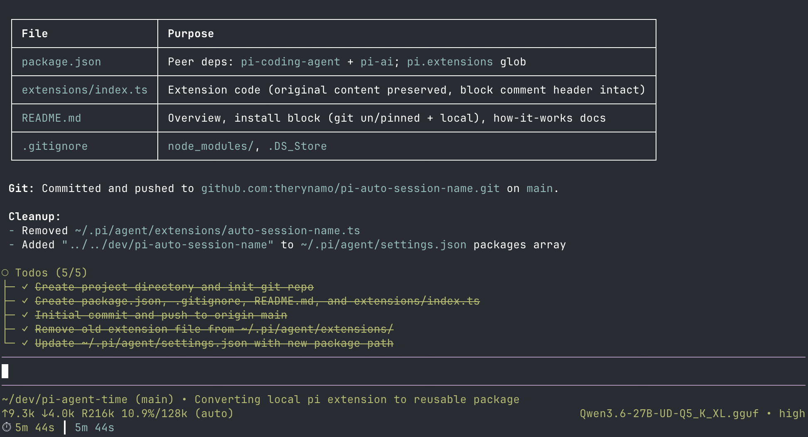

# pi-auto-session-name

Automatically generate a short working title for your Pi sessions based on the conversation.

When you start a new session and finish your first turn, this extension asks the session model to summarize the conversation into a concise, specific title — so your sessions are always named after what you actually did instead of staying as "New Session".



## Usage

### Install

```bash
# From git (unpinned — updates with `pi update --extensions`)
pi install git:github.com/therynamo/pi-auto-session-name

# Pin to a tag
pi install git:github.com/therynamo/pi-auto-session-name@v0.1.0

# Local development
pi install /Users/theryngroetken/dev/pi-auto-session-name
```

### Controls

No manual controls needed — the extension fires automatically after the first assistant response. You can still rename the session manually at any time afterward.

## How it works

1. After the first turn completes (the agent has responded), the extension collects the user's messages from the conversation
2. It sends a prompt to the session's current model asking for a short, specific title (max 60 characters)
3. The generated title is set as the session name via `pi.setSessionName()`
4. This only runs once per session — subsequent turns are unaffected, and manual renaming always works
